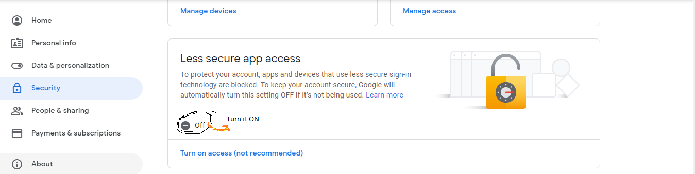

# NewsLetter Subscription API
### An API for sending the mails to the person who have subscribed 

### Setting the Newsletter in the local Machine <br>
* Fork the repository and clone it using Command line :
```
git clone https://github.com/Real-DeviLs/Newsletter-subscription.git 
```
* Installing all the dependencies 
```
npm install
```
* Set up the [`.env`](.env) file according to format given in [`.env.sample`](.env.sample)
* Use the mongoDb locally or the remote mongoDb atlas [link](https://www.mongodb.com/try)
* Make a cluster of free tire and fill all the credentias in the `.env` file
* After making all these setup run `npm start` in your terminal and your server is up and running <br>

#### NOTE
**make sure you turn `ON` this  for sending the mails**

--------------------------
### Impovements required
 * *need to be done in the frontend part* 
 * *Making the templated mails*
 
 